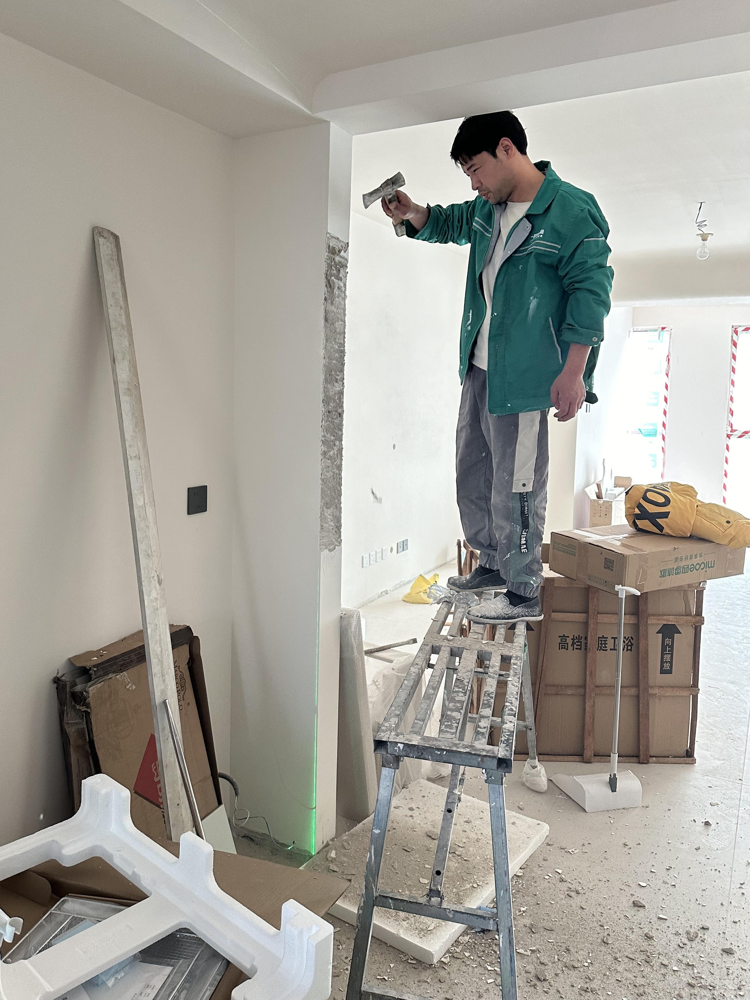
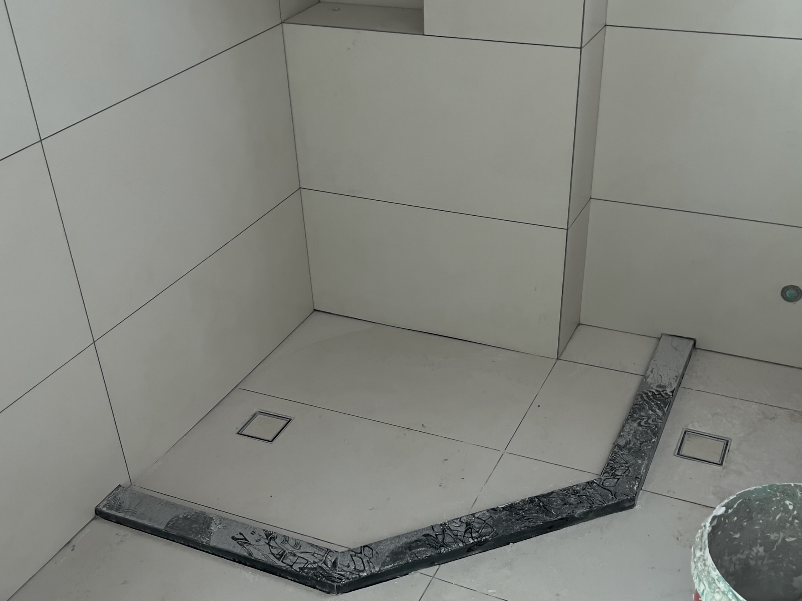

# 买房 / 装修的自我检讨

从买房到装修，三年时间，真金白银砸出来的血泪史。尝试总结一下经验教训。下次尽可能避免。

## Part 0: 买房

先把选房的工作做好，才能去谈装修的事情。有很多问题，是装修完全解决不了的。

### 下单前务就必须已经考虑清楚的事情（重要）

1. 提前检查漏水 / 返潮状况：

    - 没有后悔药。

    - 漏水问题太复杂，想修复大概率依赖物业，甚至依赖一个靠谱的邻居（可遇不可求，不要赌命）。

    - 返潮为建筑质量问题，无救。

2. 关于注浆：

    - 不要天真地认为注浆可以解决漏水问题，注浆是不可逆操作，漏水点存下的水会在注浆后找到新的出口，甚至会在墙体内部扩散（不一定哪里就会出现新的漏水点）。没有后悔药。

3. 需详细了解阳台区域是否可以封窗 / 更换，如果不可以，那自带的门窗是否靠谱：

    - 同样没有后悔药，将严重影响墙体改造和空调风路设计。

    - 注意这个事儿物业说了不算，一般是查违建的城管决定是否可以。

4. 赠送大面积阳台的房子，多半不会设计固定的空调外机位（因为人家默认你不封阳台且外机直接放在阳台上），所以不要贪图赠送面积，指不定会有什么问题。

## Part 1: 装修

### 写在前面

1. 装修设计，无图不开工。有图都不能保证不出问题，无图更白扯。

2. 装修的过程中，进度管理非常重要，可以说仅次于设计了。如果有必要的话，**甘特图**（解决工序并发的问题）和`TODO List`（管理每日任务）搞起来（这两样我都没搞，无比后悔）。

### 关于墙体

1. 厨卫拆除 / 新建墙体时就考虑上下水：

    - 水槽 / 洗碗机等配置需要考虑下水改造（下水管隐藏在橱柜中）

    - 燃气灶、烟机需要考虑燃气管和烟道位置（几乎不可动）

2. 厨房在合理状况下扩大到能扩大到的最大尺寸（设计时动线优先级远远低于尺寸）

3. 卫生间也是一样，尽可能扩大尺寸。

4. 如果有三面围墙嵌入柜体的情况，切记一点：背板、上沿、左右两侧的尺寸，在全屋定制时都需要预留尺寸加封版以屏蔽墙体不平的问题。所以柜子的实际可使用空间会比预期小很多（实际使用深度需要格外留意，衣柜深度建议 `55cm` 到 `60cm` 之间，鞋柜深度建议 `35cm` 左右，书架 `24cm` 到 `30cm` 之间，储物柜置物架随意）。根据参考尺寸，切记务必留有余量。

5. 可能涉及做衣柜的衔接处墙体，务必事先找直。发现的晚，后果就是这样 ———— 完工的墙刨了：

    

    这套房子的墙已经刨了两处了。这还是在大部分墙面放弃找直的前提下。

6. 砌墙的时候可以事先咨询一下墙体用的砖的类型，如果涉及吊装家具家电，空心砖一定无法满足承重需求（即便是热水器这种需要打钉固定的家电，如果胀钉打透空心砖，也起不到固定作用）。

---

### 关于吊顶

1. 能少做就少做（主要问题是压层高，藏虫）。各个区域吊顶的厚度，一般参考暗藏设备，包括管路，内嵌照明等等。

2. 如果阳台部分需要吊顶，厚度则需要额外参考电动晾衣架暗装的厚度并且按照选定的晾衣架款式开暗装槽。暗装槽需要四周封闭，但露出天花板。尽可能避免棚顶下面还有薄薄一层吊顶的情况（安装师傅说，这样的情况晾衣架非常不好安装，而且有打孔打到电管路的风险）。

3. 吊顶时要考虑好预留窗帘盒，如果你确定需要带纱帘，预留窗帘盒位置的宽度应该是 `25cm` 左右，不要相信任何人说的 `20cm` 足够的话，窗帘收起状态是有褶皱的，褶皱多厚不仅长度也受材质影响。如果我确定不需要带纱帘，预留窗帘盒位置的宽度我下次仍然会做成 `20cm`。这玩意儿留点富裕肯定是没问题的。

4. 如果需要在吊顶上安装 `Yeelight` 青空灯，切记，石膏板吊顶应该直接开孔，而不是做一个内嵌槽。后期拆除不但非常麻烦也会影响可靠性。另外补充一句，青空灯虽然效果惊艳，但是尺寸和安装方式均是针对铝扣板设计，石膏板安装方式青空灯，也许（我强调了是也许）是人类能想象出来的最反人类的安装方式（四点吊装 + 磁吸装饰框，这个结构就不可能稳定），如果不是极度喜欢，那就别装（对，我极度喜欢，妈的）。

---

### 关于空调

1. 务必提前详尽了解预设的空调外机位（影响空调选型）。有赠送阳台的户型，一般是不提供外机位的。

2. 空调外机位，前后均需要预留空间。原因是：

    - 外机需要穿透型风道

    - 外机如果需要维护，外机位空间需容纳维护人员进出

3. 普通空调选择优先级远远大于中央空调，中央空调的问题如下：

    - 进场极早，安装方式不统一（几乎都是线下聊，且依赖提前设计内外机位置；即便你买的是超薄的机型，安装不贴着天花板也没意义）

    - 打孔数量多，管路长，尤其梁和承重墙打孔的问题是隐患

    - 与吊顶设计问题纠缠在一起，引入额外心智负担

    - 一体智能化方案非常差（几乎没有原生支持米家/苹果家庭的型号，第三方VRF则比较挑型号）

4. 如果无奈必须选择中央空调，则务必留意以下几点：

    - 一定要在某个室内机位的吊顶内部预留一路电源插座（用于`VRF`控制器）

    - 中央空调的控制面板和室内机不要离得过远，造成理解上额外的心智负担

5. 关于`VRF`控制器，切记，有些空调是装在外机上的，有些空调是装在内机上的，具体安装方式需要查询清楚。

---

### 关于新风

1. 安装新风时本人务必在场，无论图上画得多么清楚。如果因为某些原因，细节和事先预定的图无法做到一致，安装新风的师傅是不会通知你的。而装完的时候你才知道和预期不一致，而且如果因为这些原因造成多两三个大弯，没有人会对这件事情负责，而涉及外墙打孔的情况，是没有重做的机会的。

2. 打孔时需着重关注打孔位置，减少弯头数量（每个弯风量损失5%）。比如：

    - （在选择中央空调的情况下）主管道躲避中央空调室内机，最可能造成弯

    - 安装新风主机时的位置会躲避房梁，也会造成大弯

3. 可以考虑独立新风机而非吊顶新风机，甚至在不选择中央空调的时候，可以直接选新风空调（新风空调为第一优先级选择）。

---

### 关于水电

1. 软水水路其实不算是刚需，原因如下：

    - 软水机体积较大，占用橱柜空间，设计橱柜时增加心智负担

    - 管路记忆心智负担极重（自来水，初滤水，软水，净水，热水）

    - 水垢问题：白色花洒龙头等已经普及，水垢问题仅考虑淋浴房玻璃即可（及时擦干其实问题也不大）

2. 务必和电工师傅强调，火线零线地线灯线一定要使用正确的颜色。如果颜色出问题后期安装各种电器都会受到影响（不要觉得这种级别的常识师傅都懂，偷懒和省料这种事儿你打工你也不会拒绝的）。

3. 电工标准的`86`盒，根据螺丝孔位分类可以分为两种，一种是标准螺丝，一种是自攻螺丝。而你自行购买的所有开关插座，都是赠送标准螺丝的。如果你不提前和电工师傅交代好，他们会默认使用自攻螺丝。如果你有需求，可以尝试和装修公司沟通了解是否可以使用标准螺丝版`86`盒。

4. 还是关于电工选择的`86`盒，要和电工师傅沟通好，如非必要，尽可能使用最深的标准盒以满足使用内嵌插座的需求（保留改造可能性）。

5. 如果想要所有并排的开关插座紧贴的效果，务必提前交代给水电师傅，并且提前买好固定件（其实个人不太倾向这么做，毕竟开关种类繁多，外观也各不相同）。

6. 一般情况下，其实你不会需要单个位置一整排墙插，比如桌下场景我认为最多三个就绝对够用了（一个接地面插排，一个桌面插排，一个临时应急）。

7. 橱柜台面上方的插座，其实有一种新选择：轨道插座。会有两个好处：

    - 轨道插座可以动态调整每个开关的位置，彻底告别走线问题。

    - 轨道插座一般都带灯，高度也恰好合适（橱柜如果你不增项做下探收纳格，直接内嵌的灯带高度其实是非常不合适的，直视问题完全没法避免）

    当然，这里需要留意的是，轨道插座的电源线一定要大电流的。

8. 带照明功能的厨房凉霸、洗手间浴霸、阳台晾衣架等，不需要留灯控线，纯浪费（使用集成设备的照明功能，保持时刻通电）。原则上必须留灯控线的场景，只有当前位置**绝对是纯照明**的情况。

9. 冰箱如果有全嵌的想法，务必把冰箱位插头放在正上方而不是底部。

10. 厨下电位设计时就要有橱柜的大体雏形了，否则板材上会到处都是孔。

11. 橱柜吊柜后方务必留电位，否则后期想加灯带就很麻烦了（橱柜台面操作时是背对主灯的，身体也会挡光，期待光线条件很好基本不可能）。

12. 务必要留意花洒的出水口是否凸出瓷砖，如果凸出，会导致花洒无法完全贴合墙面，露出水管。正确的做法是出水孔相对瓷砖内陷 `5mm` 左右，这样大部分花洒基本都可以保证贴合（如果工长坚持并强调施工规范什么的，提前强调好装花洒要是出事儿就找他就完事儿了）。

13. 智能马桶边的上水管，留一个就足够了，现在市售的马桶喷枪一般都自带多一路的出水，可以直接接到智能马桶上（准确地说，不带多一路出水的马桶喷枪反而不多见）。多了浪费，而且留个水口窟窿巨丑无比。

14. 如果洗手间有安装电热毛巾架的需求，务必提前预留电位。这次没留就只能选择普通毛巾架了，十分遗憾。

15. 各个房间的电位预留，务必考虑好全屋定制柜体会对电位产生的遮挡。哪怕打孔，用起来也会很不方便。

---

### 关于卫浴

1. 不要迷信线下，价格真的离谱，所谓的强售后，完全看对接人怎么样。线上至少价格优势极大（这点针对成品浴缸浴室柜马桶花洒，不包含定制淋浴房之类的产品）。

2. 线上购买浴室柜时，务必看买家秀，不要看卖家秀。以及一定不要提前购买，七天无理由退换货周期内下单，安装，试用。否则后期骑虎难下（遇上货不对板的情况欲哭无泪）。

3. 壁挂马桶是妥协的选择，只要马桶不需要移位，一定选普通马桶，选择丰富得多得多的同时，价格也合理得多得多（尼玛法恩莎的壁挂马桶又贵又拉胯，这么贵的东西电结构都尼玛能设计出隐患来）。

4. 普通落地马桶的坑距是从下水管正中心开始测量而不是边缘。

5. 淋浴房设计需更谨慎：

    - 菱形淋浴房需要考虑花洒两侧最窄边的长度，这是影响洗澡时受限感的最重要数据

    - 花洒本身是凸出来的，需要考虑尺寸；花洒喷水角度是倾斜的，需要考虑淋浴房和墙面的距离（即斜喷到淋浴房玻璃的位置）

    - 淋浴房的石基，定制时务必咨询好宽度，默认会是 `80mm` 宽的石基，巨丑无比。一般定制淋浴房的厂家都至少可以做到 `60mm` 宽的石基，甚至更窄（就尼玛法恩莎得做的傻宽傻宽的）。`80mm` 宽的石基效果如下：

        

6. 成品浴缸会遇到巨大缝隙这种恶心问题（即便有支脚可以调到最低的型号也没用，卫生间的地面也是有坡度的）。最好买买嵌入式的浴缸然后四面都包上（这样最保险`100%`无缝），要不就花大价钱定制（钞能力能解决装修中的大部分问题）。

7. 卫生间浴霸也要接止逆阀，但是接法尽可能传统。浴霸排风能力远不及吸油烟机，如果风量吹不开止逆阀，会导致浴霸换气功能完全失效（对，我的卫生间已经失效了）。

8. One More Thing: 记住 **永久拉黑法恩莎** 就完事儿了。高端个鸡毛，贵是真贵，东西拉胯服务更拉胯。

---

### 关于瓷砖

1. 对缝非常重要，不要信任何人说的对缝不重要，也不要光看平面图，平面图是看不出来不对缝的惨状的。

2. 贴砖完成后，务必让装修师傅贴水电定位线，所有的都要贴，否则各种需要打孔的场景都会打爆水管 / 打断电管。

---

### 关于橱柜

1. 装修公司本身是不提供橱柜服务的，都是包给第三方橱柜厂家。记得，包给哪儿是可以谈的。如果我下次装修，一定会先打听清楚有哪些厂家可供选择。

2. 现在的工艺为板材 + 横梁 + 台面，切记设计上要尽可能简单，不要作死。厨房有水，缝隙藏污藏虫的问题会更明显（可以提前问下橱柜厂家能不能做老结构）。有一说一这一点非常非常恶心的。柜体再不存在封闭空间。

3. 现在橱柜出的图纸极其简单粗暴落后原始，表意不清，不要轻易签字。优先谈一下精确图纸的格式和沟通方式。

4. 下次装橱柜，我会更倾向于设计水泥台，先杜绝最大的缝隙。如果真的由于尺寸无法精确而无法做水泥台，那么我一定尝试100%封死所有缝隙。

5. 下次橱柜板材我一定会选纯白或者浅色，无论加多少钱（对，这句话是针对我妈的）。

6. 转角的空间其实非常非常不好用。如果不得不使用转角，设计时要考虑开门和伸手够东西的场景。

7. 如非必要，尽可能选择独立水槽 + 洗碗机而非集成水槽（功能越单一越好）。

8. 一般定制橱柜的厂家，套餐内吊柜的高度都不低。如果我下次再设计橱柜，我一定增项做一段下返开放格，用来放些最常用的东西。降下来的高度底部可以加灯带了（高度足够低就可以一定程度防直视了）。

9. 橱柜的免拉手务必问清楚金属板的位置，如果不是和抽屉一体，则会严重影响抽屉深度。

10. **永久拉黑地曼德**。这是个天津本地商家，但内部管理混乱，极不正规，流程模糊，几乎对接过的所有员工（也许可以除去安装师傅）都不敬业，推诿扯皮，责任感奇差。

---

### 关于备件

1. 角阀 / 球阀务必提前购买（各个涉水家具家电的角阀），选择快装堵头型号，避免仅用生料带的型号（绝大部分师傅建议快装堵头 + 生料带的双保险）。

2. 止逆阀，卫生间厨房烟道设计（止逆阀务必提前装好，否则吊顶竣工以后返工不是一般的麻烦）。

3. 玻璃胶这类的东西也最好自己买。根据装修风格会需要不同的颜色（比如当前这套房所需要的只有白色和透明色）。但出于保质期和避免浪费角度考虑最好随用随买（所以需要对安装步骤有预估）。原因如下：

    - 各个工序的工人大部分都会自行携带胶，但很可能恰好不是你需要的颜色，甚至不是适合你的种类（乳胶漆面打普通玻璃胶我真的是欲哭无泪）。

    - 胶切除重打后会留胶痕，重新打胶大概率无法遮盖，师傅完成工序又着急走，所以强迫症的话，大概率需要自己动手做些工作。

    - 硅酮胶是市场的绝对主流，不过最近有一种叫做`MS`胶的东西，据说可替代硅酮胶（硅酮胶必含甲醛），但是我没用过。代表产品为**硅宝603**，记住这个型号顺着搜索也能了解一些相关的信息。

4. 装修这么长的流程，有备件和材料浪费是正常的，只能劝自己心态稍微放平一些（当然了其实我浪费的东西有点多，适当优化统计和采购流程可避免）。

---

### 关于照明

1. 筒灯的防眩光其实是个伪命题，只是加了个类似射灯的杯深度结构，只不过很浅而已（比如 `Yeelight` 最新的 `M3` 筒灯的结构对视觉效果并没有什么加成，某些角度直视刺眼的困扰仍然存在）。

2. 无主灯设计还是以看着好看为主，要是说好用真谈不上，谁用谁知道。筒射灯的发光密度本身就高，而所谓的「见光不见灯」只是角度问题而已。不过成本差距不大，可酌情考虑。

---

### 关于定制

1. 灯带是深坑，非必要不加。厂家提供的灯带光源素质远远落后于时代的同时价格离谱，自购灯带安装需要师傅现场开槽，手工费仍然离谱。

2. 少做抽屉多做层板，抽屉的浪费空间现象太严重（轨道五金公差等），而且承重问题需要额外考虑。

### 关于网络

1. TODO: 如果有节点需要光纤覆盖。

2. TODO: AC+AP模式的布网方案。

## Part 3: 写在最后

以上是装修过程中的经验教训，其实对于这种流程超长、对接方极多、几乎100%定制化的非标准工程来说，这个文档中的坑，远远不能覆盖完整（可能有大量的坑由于提前做过功课所以没踩到），此文，只能作为我对自己装修过程的一个血泪总结，希望下一次自己不会这么天真和理想化。通过一篇文档，让自己在下次遇到装修这样的工程时，学会降低期待值，接受自己会犯错，同时尽可能避免同样的问题反复发生，才是记录的价值。
